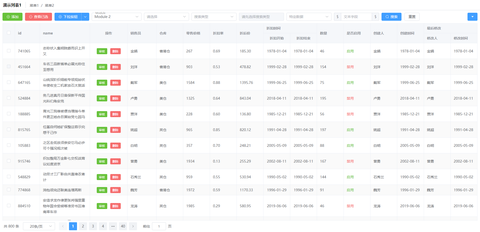

# Vue Listview 3.x

[](https://github.com/laomao800/vue-listview3/actions/workflows/ci.yml)
[](https://coveralls.io/github/laomao800/vue-listview3?branch=master)

一个基于 [Vue 3](https://cn.vuejs.org/) 和 [Element Plus](https://element-plus.org/) 的列表类页面布局组件。

> Vue 2 使用请查看 [Listview 2.x](https://github.com/laomao800/vue-listview) 版本。




## 文档

- 文档： https://laomao800.github.io/vue-listview3/
- Demo： https://laomao800.github.io/vue-listview3/demo/

## 安装

```bash
yarn add @laomao800/vue-listview@3

# OR

npm install @laomao800/vue-listview@3
```
